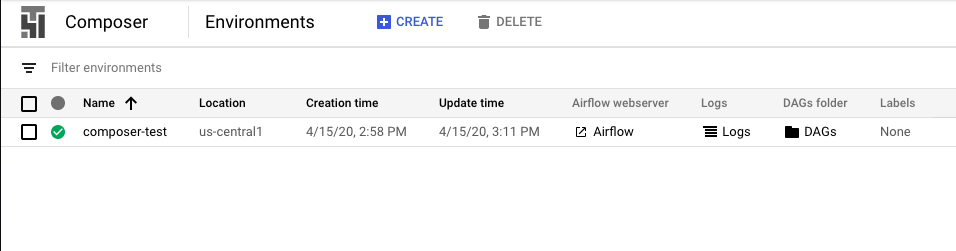

# cloud_composer
This project is a demo for using Airflow on Google Cloud Composer to manage the ML pipeline with resource autoscalability.

# Initiate node pools 
Follow the basic GKE cluster setup as: 

Additional node pool `n1-lowmem-2-pool` is created for model serving or other low resource purpose.

In order for Composer to use these node pools, we need to first go to GKE engine in the console 

`"Create cluster" -> "Add node pool" -> "Enable autoscaling" -> set "Minimum number of nodes" to 0 -> "Create" cluster`

The reason to set minimum to 0 is when GPU not used the node will shut down.

After all node pools are set, go back to Composer to finish setting up the Airflow node pool

Once set up, you can check the Log and DAG directory by clicking on the 
Ok I'm calling the project `composer-test`, so the URI for the DAGs are under `gs://us-central1-composer-test-61840402-bucket/dags/` 

Log in to the 
